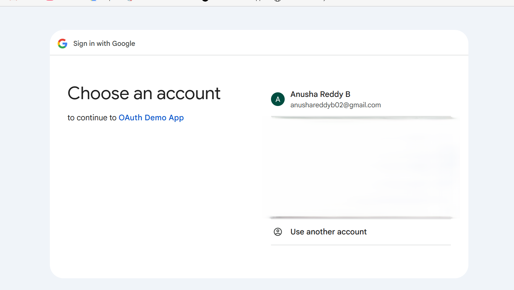
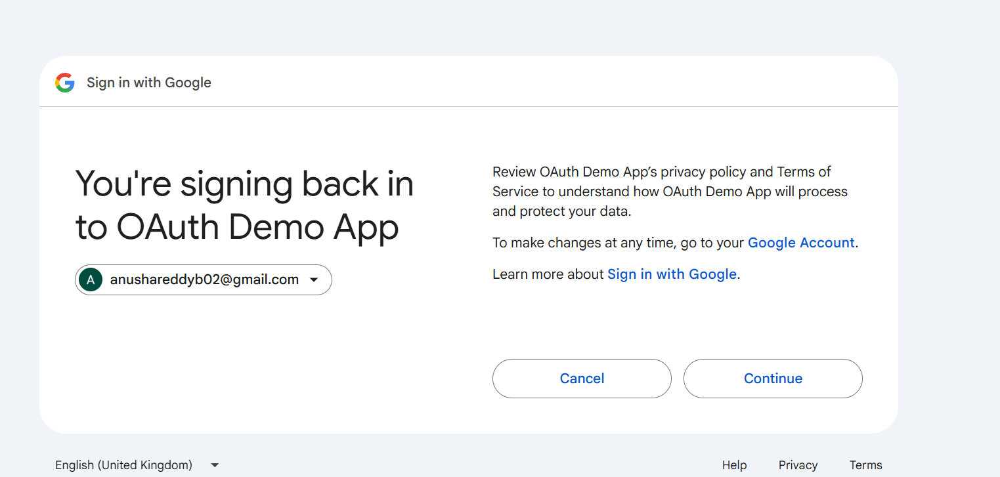
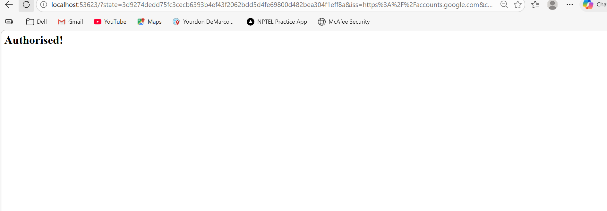

# 🔐 Google OAuth 2.0 Authentication (Python)
Google OAuth 2.0 authentication in Python with token handling and user profile retrieval

This project demonstrates how to implement **Google OAuth 2.0 login** using Python.

## 🚀 Features

* Secure Google Sign-In
* OAuth 2.0 Authorization Code Flow
* Access & Refresh Token handling
* User profile & email retrieval
* Token verification

## 🛠 Technologies Used

* Python
* OAuth 2.0
* Google Identity Services
* Requests library

## 📌 How It Works

1. User clicks login
2. Google authentication page opens
3. User grants permission
4. Authorization code returned
5. Access token generated
6. User profile retrieved

## ⚙ Setup Instructions

### 1️⃣ Clone repository

```bash
git clone https://github.com/YOUR_USERNAME/google-oauth-python.git
cd google-oauth-python
```

### 2️⃣ Install dependencies

```bash
pip install requests
```

### 3️⃣ Add credentials

Create `secrets.json` from Google Cloud Console and place it in the project root.

### 4️⃣ Run the script

```bash
python script.py
```

## 🔐 Security Note

Do NOT upload your `secrets.json` file. Keep credentials private.

## 📷 Output Example

✔ Google login opens
✔ User authorizes
✔ Access token generated
✔ User email retrieved

### 🟢 Step 1: Choose Google Account

User selects the Google account to continue authentication.



---

### 🟢 Step 2: Confirm Sign-In

User confirms permission to sign in to the application.



---

### 🟢 Step 3: Authorization Successful

After successful login, the local server confirms authorization.



---

## 🧾 Sample Console Output

After authentication, the script prints token details:

```text
Tokens:
{
  'access_token': 'ya29.a0AfH6SM...',
  'expires_in': 3599,
  'refresh_token': '1//0gFExample...',
  'scope': 'openid email profile',
  'token_type': 'Bearer'
}

Token info:
{
  'email_verified': 'true',
  'scope': 'openid email profile',
  'expires_in': '3598',
  'access_type': 'offline'
}

## 🎯 Use Cases

* Web & mobile login systems
* Secure authentication
* Single Sign-On (SSO)
* OAuth learning & demos

---

⭐ If you found this useful, consider starring the repo!
